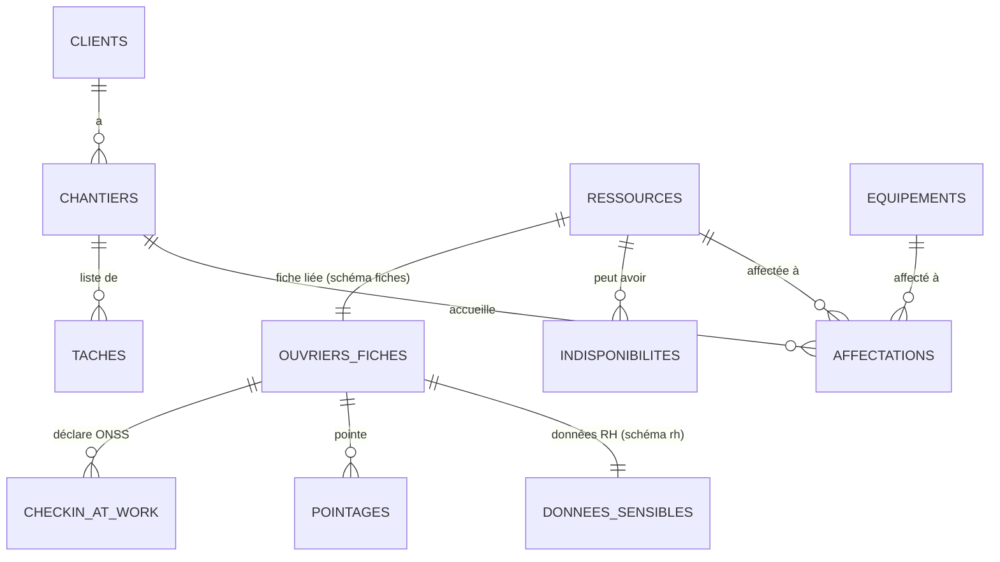

# Schéma base de données — ERP DIAGON, module Planning

**Version :** 0.1
**Date :** 16 avril 2026
**Moteur :** PostgreSQL 16+
**Auteur :** élaboré avec Claude, validé par Frans

---

## 1. Principes directeurs

### 1.1 Architecture en 3 schémas étanches

Pour concilier l'usage de l'IA (pilotage vocal) et la stricte confidentialité des données RH imposée par le RGPD et Check-in@Work ONSS, la base est découpée en **3 schémas PostgreSQL séparés**, chacun avec ses propres rôles et permissions.

| Schéma | Contenu | Accès IA | Chiffrement repos |
|---|---|---|---|
| `planning` | Chantiers, affectations, tâches, prénoms uniquement | ✅ Oui | Non (non sensible) |
| `fiches` | Photo, nom complet, date naissance, titre ouvrier | ❌ Non | Oui |
| `rh` | Registre national, adresse, téléphone, pointages, salaires | ❌ Jamais | Oui (AES-256) |

**Règle d'or :** l'API exposée à l'IA (Claude) ne voit que le schéma `planning`. Aucune requête sortant vers Claude ne peut contenir de données des schémas `fiches` ou `rh`.

### 1.2 Décisions structurantes (validées avec Frans)

- **Granularité** : journée entière uniquement (pas de demi-journée).
- **Un ouvrier = un chantier/jour** : contrainte unique `(ressource_id, date)` dans `affectations`.
- **Équipements planifiés** dès le MVP (nacelles, échafaudages, matériel lourd) — table séparée de `ressources` humaines.
- **Encadrement non imputable** au planning chantier (Frans, Kevin, Laurent, Olivier, Julie).

---

## 2. Schéma `planning` (opérationnel, IA OK)

### 2.1 Table `clients`

```sql
CREATE TABLE planning.clients (
  id            SERIAL PRIMARY KEY,
  nom           VARCHAR(100) NOT NULL,
  actif         BOOLEAN DEFAULT TRUE,
  cree_le       TIMESTAMPTZ DEFAULT now()
);
```

Exemples : PICARD, MOURY, DE GRAEVE, DUCHENE, LARCO, COLLARD, RENO.ENERGY, BIEMAR, Hobby service.

### 2.2 Table `chantiers`

```sql
CREATE TABLE planning.chantiers (
  id              INT PRIMARY KEY,              -- N° chantier DIAGON (365, 376, 385, ...)
  client_id       INT REFERENCES planning.clients(id),
  nom             VARCHAR(150) NOT NULL,        -- ex: "INTERNAT DE SPA"
  adresse         TEXT,                          -- ex: "250 Avenue Reine Astrid, 4900 Spa"
  code_postal     VARCHAR(10),
  ville           VARCHAR(80),
  onss_id         VARCHAR(30),                  -- ID Check-in@Work (1Y102XXXXXXXZ)
  statut          VARCHAR(20) DEFAULT 'actif',  -- actif / termine / suspendu / prevu
  date_debut      DATE,
  date_fin_prevue DATE,
  couleur_hex     VARCHAR(7),                   -- ex: '#3b82f6' pour affichage planning
  notes           TEXT,
  cree_le         TIMESTAMPTZ DEFAULT now()
);
```

### 2.3 Table `ressources` (humaines)

```sql
CREATE TYPE planning.categorie_ressource AS ENUM (
  'ouvrier_chantier',
  'ouvrier_atelier',
  'encadrement',
  'interim',
  'sous_traitant_equipe'
);

CREATE TABLE planning.ressources (
  id                          SERIAL PRIMARY KEY,
  prenom                      VARCHAR(50) NOT NULL,     -- SEUL le prénom en base planning
  categorie                   planning.categorie_ressource NOT NULL,
  imputable_planning_chantier BOOLEAN NOT NULL DEFAULT TRUE, -- FALSE pour encadrement
  fiche_id                    INT,                      -- FK vers fiches.ouvriers (pas de contrainte SQL pour étanchéité)
  actif                       BOOLEAN DEFAULT TRUE,
  cree_le                     TIMESTAMPTZ DEFAULT now()
);
```

**Contenu initial** (d'après Frans) :

| Prénom | Catégorie | Imputable planning |
|---|---|---|
| Enrique, Jordan, Adel, Yassin, Romuald, Joseph, Mickaël, Eyden | ouvrier_chantier | ✅ |
| Adrien, Christian, Aron | ouvrier_atelier | ✅ |
| François (Frans), Kevin, Laurent, Olivier, Julie | encadrement | ❌ |
| Intérim 1 | interim | ✅ (activable au besoin) |
| Sous-traitant A | sous_traitant_equipe | ✅ (activable au besoin) |

### 2.4 Table `equipements` (matériel planifiable)

```sql
CREATE TYPE planning.type_equipement AS ENUM (
  'nacelle',
  'echafaudage',
  'camion',
  'remorque',
  'outillage_lourd',
  'autre'
);

CREATE TABLE planning.equipements (
  id              SERIAL PRIMARY KEY,
  nom             VARCHAR(100) NOT NULL,        -- ex: "Nacelle Haulotte 12m"
  type            planning.type_equipement NOT NULL,
  numero_serie    VARCHAR(80),
  hauteur_max_m   NUMERIC(5,2),
  capacite_kg     INT,
  date_revision   DATE,                         -- dernière révision
  actif           BOOLEAN DEFAULT TRUE,
  notes           TEXT,
  cree_le         TIMESTAMPTZ DEFAULT now()
);
```

### 2.5 Table `affectations` (cœur du planning)

```sql
CREATE TABLE planning.affectations (
  id             BIGSERIAL PRIMARY KEY,
  date_jour      DATE NOT NULL,
  chantier_id    INT NOT NULL REFERENCES planning.chantiers(id),
  ressource_id   INT REFERENCES planning.ressources(id),
  equipement_id  INT REFERENCES planning.equipements(id),
  commentaire    TEXT,                          -- cas exceptionnel "rare" (ex: part à 14h ailleurs)
  cree_par       VARCHAR(50),                   -- utilisateur app
  cree_le        TIMESTAMPTZ DEFAULT now(),
  modifie_le     TIMESTAMPTZ DEFAULT now(),

  -- Règles métier
  CONSTRAINT ressource_xor_equipement
    CHECK ((ressource_id IS NOT NULL)::int + (equipement_id IS NOT NULL)::int = 1),
  CONSTRAINT unique_ressource_jour
    UNIQUE (ressource_id, date_jour),
  CONSTRAINT unique_equipement_jour
    UNIQUE (equipement_id, date_jour)
);

CREATE INDEX idx_aff_date ON planning.affectations(date_jour);
CREATE INDEX idx_aff_chantier_date ON planning.affectations(chantier_id, date_jour);
```

**Note :** une ligne = un humain OU un équipement (jamais les deux). La contrainte `xor` garantit cela. Pour une équipe sur un chantier, il y aura N lignes le même jour avec `chantier_id` identique.

### 2.6 Table `indisponibilites`

```sql
CREATE TYPE planning.motif_indispo AS ENUM (
  'conge',
  'maladie',
  'formation',
  'rdv_medical',
  'autre'
);

CREATE TABLE planning.indisponibilites (
  id            SERIAL PRIMARY KEY,
  ressource_id  INT NOT NULL REFERENCES planning.ressources(id),
  date_debut    DATE NOT NULL,
  date_fin      DATE NOT NULL,
  motif         planning.motif_indispo NOT NULL,
  commentaire   TEXT,
  cree_le       TIMESTAMPTZ DEFAULT now(),
  CHECK (date_fin >= date_debut)
);
```

### 2.7 Table `taches` (to-do list chantier, optionnel phase 1+)

```sql
CREATE TABLE planning.taches (
  id            SERIAL PRIMARY KEY,
  chantier_id   INT REFERENCES planning.chantiers(id),
  libelle       TEXT NOT NULL,
  priorite      INT DEFAULT 2,                  -- 1=critique, 2=normale, 3=basse
  echeance      DATE,
  fait          BOOLEAN DEFAULT FALSE,
  fait_le       TIMESTAMPTZ,
  cree_le       TIMESTAMPTZ DEFAULT now()
);
```

### 2.8 Table `utilisateurs` (auth app)

```sql
CREATE TABLE planning.utilisateurs (
  id              SERIAL PRIMARY KEY,
  email           VARCHAR(120) UNIQUE NOT NULL,
  nom_complet     VARCHAR(100),
  hash_mdp        VARCHAR(255) NOT NULL,        -- bcrypt ou argon2
  role            VARCHAR(30) NOT NULL,         -- admin / planificateur / chef_equipe / lecteur
  actif           BOOLEAN DEFAULT TRUE,
  derniere_conn   TIMESTAMPTZ,
  cree_le         TIMESTAMPTZ DEFAULT now()
);
```

### 2.9 Table `audit_log`

```sql
CREATE TABLE planning.audit_log (
  id            BIGSERIAL PRIMARY KEY,
  utilisateur   VARCHAR(120),
  action        VARCHAR(50),                    -- INSERT / UPDATE / DELETE / VOICE_APPLY
  table_cible   VARCHAR(50),
  id_cible      TEXT,
  avant         JSONB,
  apres         JSONB,
  cree_le       TIMESTAMPTZ DEFAULT now()
);
```

---

## 3. Schéma `fiches` (fiches ouvriers — PAS IA)

```sql
CREATE TABLE fiches.ouvriers (
  id                SERIAL PRIMARY KEY,
  ressource_id      INT UNIQUE,                 -- FK logique vers planning.ressources
  nom               VARCHAR(80) NOT NULL,
  prenom            VARCHAR(50) NOT NULL,
  date_naissance    DATE,
  titre_poste       VARCHAR(100),               -- "Bardeur", "Chef d'équipe", etc.
  photo_path        TEXT,                       -- chemin vers fichier photo (hors DB)
  date_entree       DATE,
  date_sortie       DATE,
  cree_le           TIMESTAMPTZ DEFAULT now()
);
```

**Accès restreint** : seuls les rôles `admin` et `rh` peuvent lire cette table. L'API exposée à Claude n'a aucun accès à ce schéma (rôle DB dédié).

---

## 4. Schéma `rh` (données sensibles — JAMAIS IA)

### 4.1 Données hypersensibles chiffrées

```sql
CREATE EXTENSION IF NOT EXISTS pgcrypto;

CREATE TABLE rh.donnees_sensibles (
  id                   SERIAL PRIMARY KEY,
  ouvrier_id           INT UNIQUE REFERENCES fiches.ouvriers(id),
  registre_national    BYTEA,                   -- chiffré AES-256
  adresse              BYTEA,                   -- chiffré
  code_postal          BYTEA,
  ville                BYTEA,
  telephone            BYTEA,
  iban                 BYTEA,
  maj_le               TIMESTAMPTZ DEFAULT now()
);
```

### 4.2 Pointages

```sql
CREATE TABLE rh.pointages (
  id                   BIGSERIAL PRIMARY KEY,
  ouvrier_id           INT REFERENCES fiches.ouvriers(id),
  date_jour            DATE NOT NULL,
  chantier_id          INT,                     -- FK logique vers planning.chantiers
  heure_debut          TIME,
  heure_fin            TIME,
  duree_pause_min      INT DEFAULT 0,
  heures_sup_min       INT DEFAULT 0,
  commentaire          TEXT,
  valide_par           VARCHAR(120),
  cree_le              TIMESTAMPTZ DEFAULT now()
);
```

### 4.3 Check-in@Work ONSS

```sql
CREATE TABLE rh.checkin_at_work (
  id                   BIGSERIAL PRIMARY KEY,
  ouvrier_id           INT REFERENCES fiches.ouvriers(id),
  chantier_id          INT,                     -- lien avec planning.chantiers.onss_id
  date_jour            DATE NOT NULL,
  heure_declaration    TIMESTAMPTZ,
  statut_onss          VARCHAR(30),             -- envoye / confirme / erreur
  reference_onss       VARCHAR(50),
  payload_envoye       JSONB,                   -- pour audit
  reponse_onss         JSONB
);
```

---

## 5. Contrôle d'accès (ACL)

### 5.1 Rôles PostgreSQL

```sql
CREATE ROLE diagon_app_planning;      -- app web : lecture/écriture planning uniquement
CREATE ROLE diagon_app_ai;            -- passerelle Claude : lecture planning, écriture affectations via fonctions
CREATE ROLE diagon_app_rh;            -- module RH : lecture/écriture fiches + rh
CREATE ROLE diagon_app_admin;         -- admin : tout
CREATE ROLE diagon_readonly_reporting; -- reporting : lecture tout sauf rh.donnees_sensibles

GRANT USAGE ON SCHEMA planning TO diagon_app_planning, diagon_app_ai, diagon_app_rh, diagon_app_admin;
GRANT USAGE ON SCHEMA fiches   TO diagon_app_rh, diagon_app_admin;
GRANT USAGE ON SCHEMA rh       TO diagon_app_rh, diagon_app_admin;

-- Important : diagon_app_ai n'a AUCUN accès à fiches ni rh
REVOKE ALL ON SCHEMA fiches, rh FROM diagon_app_ai;
```

### 5.2 Fonctions dédiées pour l'IA

L'IA ne fait pas de SQL direct. Elle appelle des **fonctions SQL nommées** (stored procedures) avec paramètres contrôlés. Exemples :

```sql
CREATE FUNCTION planning.affecter_ressource(
  p_prenom TEXT, p_chantier_id INT, p_date DATE
) RETURNS BIGINT ...;

CREATE FUNCTION planning.deplacer_affectation(
  p_prenom TEXT, p_date_source DATE, p_date_cible DATE
) RETURNS BOOLEAN ...;

CREATE FUNCTION planning.lister_libres(
  p_date DATE
) RETURNS TABLE(prenom TEXT, categorie TEXT) ...;
```

Avantage : l'IA ne peut jamais requêter directement. Toute action passe par une fonction dont les effets sont bornés, auditables, et restreints au schéma `planning`.

---

## 6. Diagramme relationnel (simplifié)



---

## 7. Points encore à valider

1. **Gestion des équipes récurrentes** : faut-il une table `equipes_base` (ex: "équipe Enrique+Jordan toujours ensemble") pour accélérer la saisie ? Ou suffisant à faire au cas par cas ?
2. **Historisation** : on garde combien de temps l'audit_log et les anciens pointages ? (suggestion : 7 ans pour conformité URSSAF belge équivalent)
3. **Photos ouvriers** : stockage filesystem (dossier Synology) ou S3-compatible (MinIO sur NAS) ? Chemin relatif dans `photo_path`.
4. **Sauvegardes** : 3-2-1 confirmé (3 copies, 2 supports, 1 hors site) — à quelle fréquence ? Suggestion : snapshot PostgreSQL quotidien + réplication vers un autre support chaque nuit + export hors site hebdomadaire.

---

## 8. Prochaines étapes

- [ ] Validation de ce schéma par Frans
- [ ] Création du dépôt Git local (Mac + push vers NAS)
- [ ] Installation Docker sur NAS Synology (à confirmer : modèle supporte bien Container Manager)
- [ ] Création du `docker-compose.yml` avec PostgreSQL 16 + app Node.js (Next.js) + reverse proxy Nginx
- [ ] Scripts de migration SQL initiaux (numérotés 001, 002, ...)
- [ ] Seed de données (clients, chantiers TB, ressources) depuis fichiers existants
